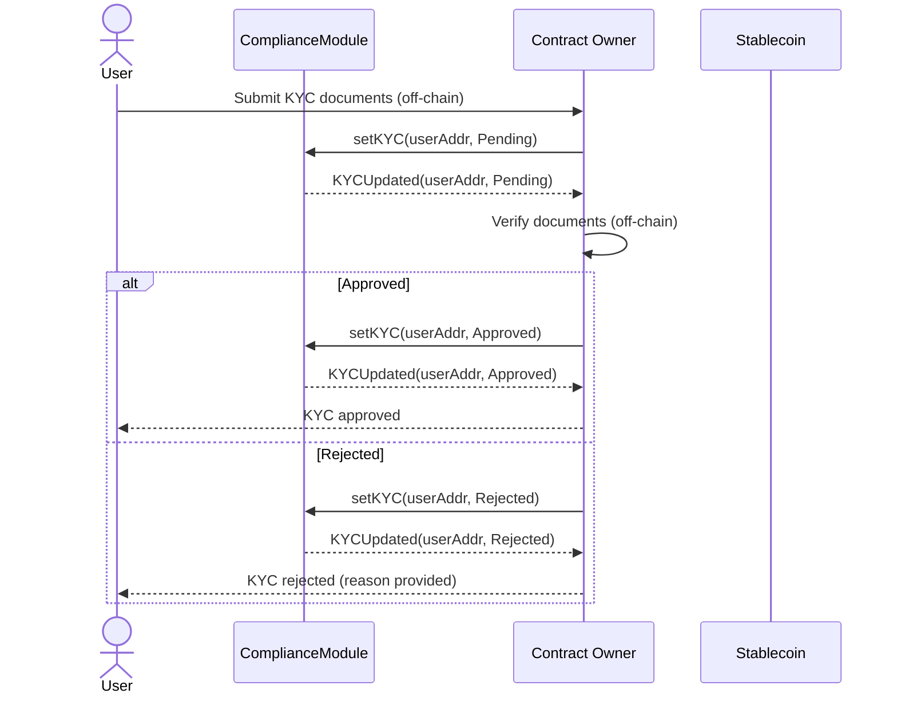
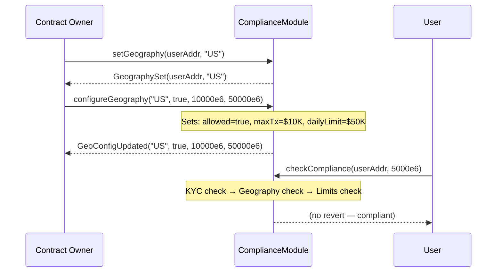
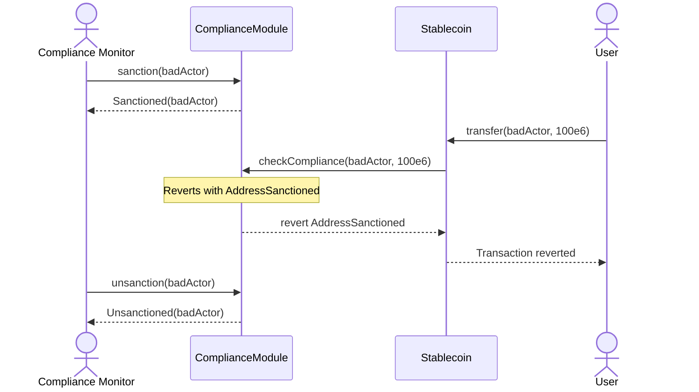
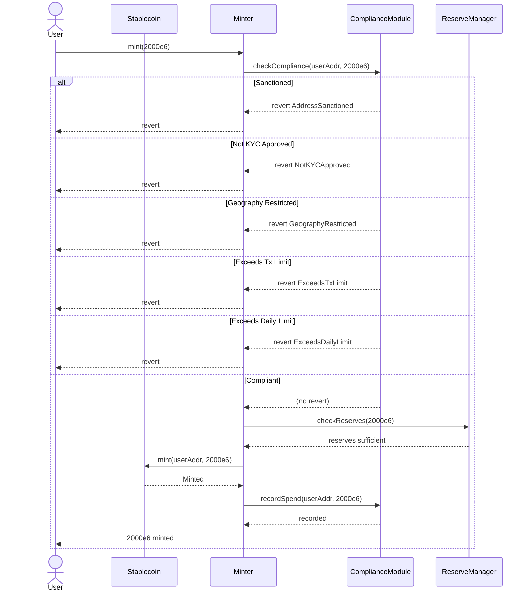
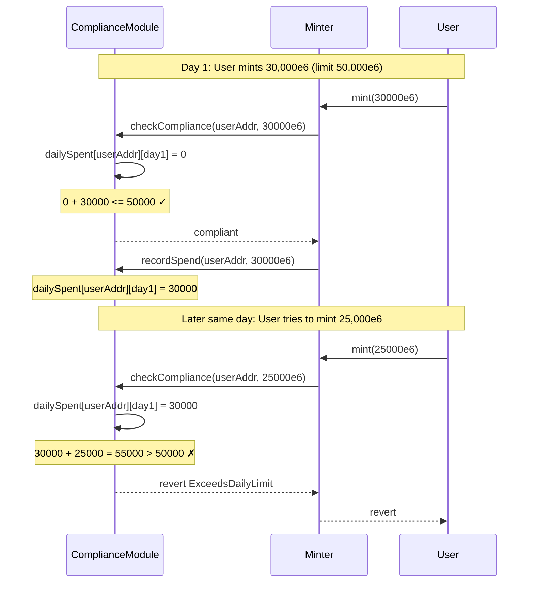

# Compliance Module — Architecture & Flows

The `ComplianceModule.sol` contract provides KYC verification, geography-based transfer restrictions, transaction limits, and sanctions screening for the stablecoin toolkit.

## Architecture

```
┌──────────────────────────────────────────────────┐
│                   ComplianceModule                │
├──────────────┬──────────────┬────────────────────┤
│   KYC Flow   │  Geography   │    Sanctions       │
│              │  Restriction │    Screening        │
├──────────────┼──────────────┼────────────────────┤
│ Pending  →   │ ISO 3166-2  │     OFAC-style      │
│ Approved/    │ code         │     flag per        │
│ Rejected     │ per address  │     address         │
└──────────────┴──────────────┴────────────────────┘
                       │
                       ▼
┌──────────────────────────────────────────────────┐
│               Transaction Gating                  │
│  checkCompliance(account, amount) called before   │
│  every mint, transfer, or redeem                  │
└──────────────────────────────────────────────────┘
```

## Sequence Diagrams

### 1. KYC Registration Flow



### 2. Geography Configuration Flow



### 3. Sanctions Screening Flow



### 4. Full Transaction Flow (Mint)



### 5. Daily Limit Tracking Flow



## Data Structures

```solidity
enum KYCStatus { None, Pending, Approved, Rejected }

struct AddressInfo {
    KYCStatus kycStatus;
    bytes2 geography;     // ISO 3166-1 alpha-2 ("US", "IN", etc.)
    bool sanctioned;
}

struct GeoConfig {
    bool allowed;
    uint256 maxTxAmount;  // max per transaction (6 decimals)
    uint256 dailyLimit;   // max per day (6 decimals)
}
```

## Configuration Patterns

| Geography | Allowed | Max Tx | Daily Limit | Notes |
|-----------|---------|--------|-------------|-------|
| US (accredited) | yes | 100,000 | 500,000 | High limit for qualified investors |
| US (retail) | yes | 10,000 | 50,000 | Standard retail limits |
| EU | yes | 50,000 | 200,000 | MiCA-compliant limits |
| Restricted | no | 0 | 0 | Blocked jurisdictions |
| Sanctioned | N/A | N/A | N/A | Frozen — cannot transact |

## Integration Guide

### Prerequisites
1. Deploy `ComplianceModule` with owner address
2. Grant `MINTER_ROLE` on `Stablecoin` to `Minter`
3. Wire `ComplianceModule.checkCompliance` into `Minter._beforeMint`

### Adding a New Geography
```
1. Owner calls configureGeography("JP", true, maxTx, dailyLimit)
2. Owner calls setGeography(userAddr, "JP") for each JP-based user
3. Verify: user transactions respect JP-specific limits
```

### Reacting to a Sanctions Event
```
1. Monitor detects sanctioned address
2. Owner calls sanction(badActorAddr)
3. All transactions from badActorAddr revert
4. After review, Owner calls unsanction(badActorAddr) to restore access
```

## Testing

See `forge-test/ComplianceModule.t.sol` for comprehensive tests covering:
- KYC status transitions (None → Pending → Approved/Rejected)
- Geography-based restriction enforcement
- Transaction limit checks
- Daily limit tracking and reset
- Sanctions blocking and unblocking
- Owner-only access control
