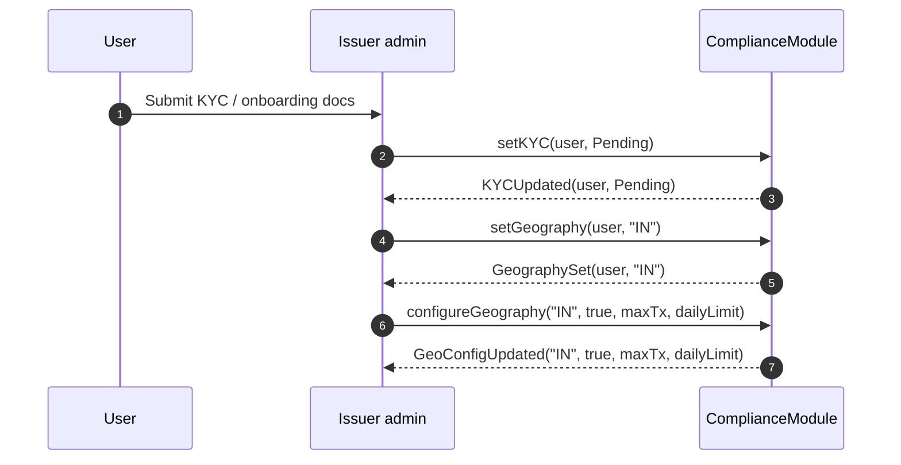
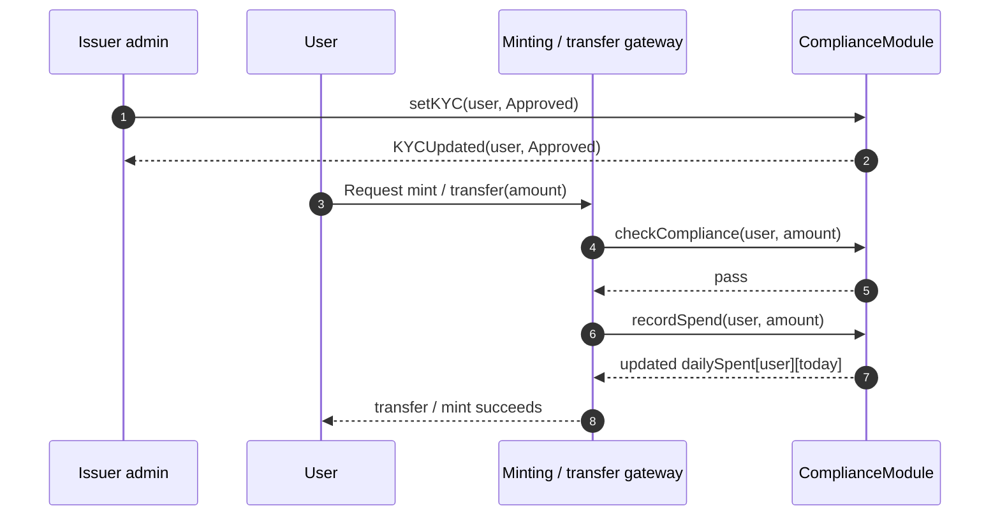
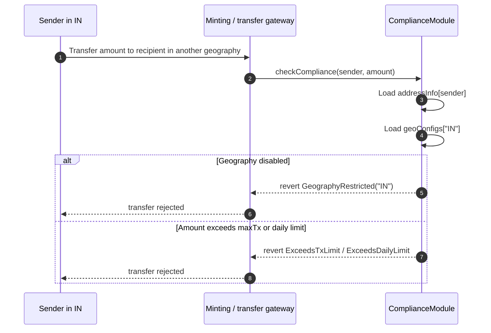

# ComplianceModule flow diagrams

`ComplianceModule.sol` is the toolkit's policy gate for KYC state, geography allowlists, sanctions, and per-address spend limits.

## What the module enforces in v0.1

- KYC status must be `Approved`
- sanctioned addresses are blocked
- geography config must be marked `allowed`
- per-transaction amount must be within `maxTxAmount`
- cumulative daily spend must remain within `dailyLimit`

## 1. User onboarding

## 2. KYC approval to first transfer

## 3. Cross-geography transfer rejection

This toolkit version enforces geography by checking the account whose action is being evaluated against its configured geography policy. In practice, a cross-geography transfer is rejected when the acting address belongs to a geography that is disabled or capped below the requested amount.

## Notes for integrators

- `checkCompliance(account, amount)` is `view` and does not mutate spend state.
- `recordSpend(account, amount)` must be called by the owner-controlled integration after a successful action so daily limits stay meaningful.
- Geography policy is currently single-account enforcement, not a bilateral sender/receiver rules engine.
- If a deployment needs pairwise geography matrices, that should be implemented as a higher-level policy module on top of this baseline contract.
